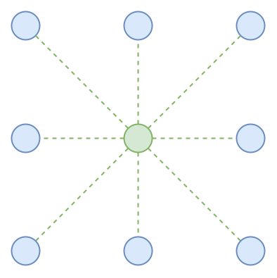
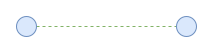
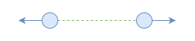

The original idea of this repository was to simulate [chladni figures](https://en.wikipedia.org/wiki/Ernst_Chladni#Chladni_figures), but I wasn't really able to produce recognizable ones. It's still fun to listen to some music and play around with, though.

#### Implementation details

Here's the idea behind it: There's a mesh of particles where every particle is connected to its neighbors via a "spring" as depicted in the following graphic.

A single simulation step will calculate the force of these springs and apply it to the particle. The **Iterations** parameter controls how often this step is repeated. A larger value will effectively cause faster propagation of changes through the mesh.

Right now the 4 corners of the mesh are fixed in place for no other reason than personal preference. In order to prevent it from forming a hyperbola<small>1</small> along the edges, the attraction force is only applied along the y-axis.

All of this happens on the CPU (the code for this is located in the `./zig-mesh` directory). Running the simulation on the GPU would probably increase the performance a lot, but that's a task for another day.

---

The **Tension** parameter $T$ controls the resting length of the springs. A value smaller than 1 will pull the particles together, whereas a value greater than one will cause the particles to repel each other. By pushing $T$ to more extreme values, one can effectively amplify the attraction or repulsion of particles.

In this configuration the spring is at equilibrium.

Expanding it to a length greater than its resting length generates a force that pulls the two particles together.

Compression of the spring causes the particles to be pushed apart.

#### How the audio affects the mesh

The particle $P$ in the center of the mesh is "excited" by the audio signal. Every frame (with respect to rendering) – before running the simulation steps mentioned earlier – the latest audio sample is taken and the y-position of $P$ is set to that value. The **Sample scale** parameter can be used to influence the amplitude.

Most devices will probably render the visualization at something like 60 frames per second. This effectively means that we downsample the audio signal to that rate. Going down from $44.1\ \text{kHz}$ to $60\ \text{Hz}$ makes the signal unrecognizable from an audio perspective. So the movements of the mesh seem erratic and random quite often.

I have tried the following to make the simulation more "realistic", but I don't think it's possible to run this fully in realtime.

* Run the simulation for every single *audio* frame (so 44100 simulations per second, if that's the sampling rate of the audio signal.)

* Only actually render the visualization at 60 frames per second or whatever the desired rate is.

However, this makes it unwatchable, because you have to wait a pretty large amount of time between every video frame. Assuming an audio sampling rate $A=44100$, a visual sampling rate $V = 60$ and a simulation execution time $t=2\text{ms}$ for every audio frame, you would get  $\frac{tA}{V} = \frac{44100\text{Hz}\ *\ 2\text{ms}}{60\text{Hz}} = 1470\text{ms}$ between redraws – or something like less than a single frame per second. Of course, $t$ was chosen rather arbitrarly here and depends on a lot of factors like the CPU, the amount of iterations, the mesh size, etc. – but the point is that you probably can't throw enough hardware on it to make it feasible to run in realtime.

You can work around this issue by assembling all of the frames into a video, but last time I checked there was no easy way to do this *in the browser*. Mind you I wrote this code more than one year ago and things seem to have changed in the meantime. I recently stumbled across the [WebCodecs API](https://developer.mozilla.org/en-US/docs/Web/API/WebCodecs_API), which sounds like it could do the job. But this is yet another task for another day.

---

<small>1At least that's what it looks like. I cannot provide any proper mathematical reasoning for this.</small>
